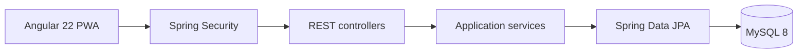
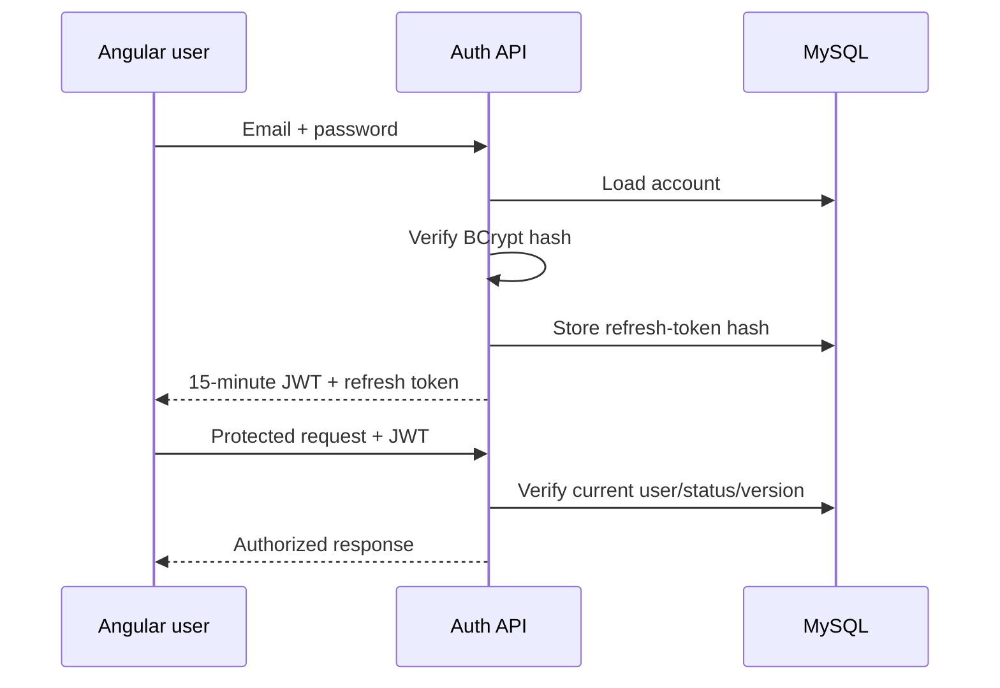

# Architecture

## Request flow

Controllers contain HTTP concerns only. Services own validation, authorization
and transactions. Repositories own persistence. DTO records keep JPA entities
out of the public API.

## Authentication flow

Access tokens are stateless HS256 JWTs. Password changes, role changes and
account disabling increment `token_version`, immediately invalidating older
access tokens. Refresh tokens are random opaque values; only their SHA-256 hash
is stored. Refresh is rotating and protected with a pessimistic database lock.

## Main ownership rules

| Role | Permissions |
|---|---|
| Public | Search, detail, compare, PDF, insurer list, stats, chatbot |
| User | Profile, password, favorites, recent history, chat history |
| Hospital staff | User permissions plus update assigned hospital only |
| Admin | Hospital, insurer, user, analytics and audit administration |

## Data responsibility

- MySQL is the source of truth for accounts, hospital directory, insurance
  mappings and signed-in personal data.
- Angular remains responsible for presentation, browser geolocation, maps,
  directions, voice recognition and PWA shell/offline behavior.
- The backend chatbot searches the same verified directory data, so it can run
  without a paid AI service or expose secret keys to the browser.
- Ratings, insurance participation and generated seed details are demonstration
  data until an administrator verifies real source information.
